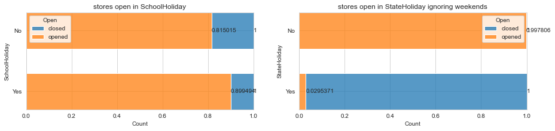

# Rossmann-Store-Sales
- time series prediction using Neural networks (NN) for Forecasting sales using store, promotion, and competitor data
- the project is split into two parts
  - data cleaning , exploratory data analysis , feature engineering in [data_analysis.ipynb](./notebooks/data_analysis.ipynb)
  - model training and evaluation in  [model_training.ipynb](./notebooks/model_training.ipynb)
- all steps for data analysis are covered in the [notebooks](./notebooks)
- data-preprocessing code and model and training code exist in [src](./src) 
- all dependencies exists in requirements.txt use `pip install -r requirements.txt`
  - `pip install git+https://github.com/ahmedbadr97/train-tracker` i used this package for model train tracking from my repos   

# Table of contents
1.[Dataset](#Dataset)
# Dataset
<p align="center"></p>>

- Rossmann, is one of the largest drug store chains in Europe with around 56,200 employees and more than 4000 stores  in Germany, Poland, Hungary, the Czech Republic, Turkey, Albania, Kosovo and Spain.
- The product range includes up to 21,700 items and can vary depending on the size of the shop and the location. In addition to drugstore goods with a focus on skin, hair, body, baby and health
- The company was founded in 1972 by Dirk Rossmann , The Rossmann family owns 60% of the company. The Hong Kong-based A.S. Watson Group owns 40%
<br><br>
- data consists of  historical sales data for 1,115 Rossmann stores 
- two csv files 
  - sales csv file has data from 2013-1-1 to 2015-7-31 each day has the sales data for the 1,115 Rossmann stores
  - stores csv , data about the 1,115 Rossmann stores 

## dataset columns
### Sales data
 <br><br>


- Id - an Id that represents a (Store, Date) duple within the test set
- Store - a unique Id for each store
- Sales - the turnover for any given day (this is what you are predicting)
- Date --> Date of the current day in the sales
- DayOfWeek (int) day of the week in numbers where 1:monday ,2:tuesday ... 7:sunday
- Customers - the number of customers on a given day
- Open - an indicator for whether the store was open: 0 = closed, 1 = open
- StateHoliday - indicates a state holiday. Normally all stores, with few exceptions, are closed on state holidays. Note that all schools are closed on public holidays and weekends.
    - a = public holiday, b = Easter holiday, c = Christmas, 0 = None
- SchoolHoliday - indicates if the (Store, Date) was affected by the closure of public schools
- Promo - indicates whether a store is running a promo on that day  

### Store data
 <br><br>


- StoreType - differentiates between 4 different store models: a, b, c, d
- Assortment - describes an assortment level: a = basic, b = extra, c = extended
  - An assortment strategy is a retail industry sales tool that optimizes the variety of goods offered for sale to consumers
- CompetitionDistance - distance in meters to the nearest competitor store
- CompetitionOpenSince\[Month/Year] - gives the approximate year and month of the time the nearest competitor was opened
- Promo2 - Promo2 is a continuing and consecutive promotion for some stores: 0 = store is not participating, 1 = store is participating
- Promo2Since\[Year/Week] - describes the year and calendar week when the store started participating in Promo2
- PromoInterval - describes the consecutive intervals Promo2 is started, naming the months the promotion is started anew. E.g. "Feb,May,Aug,Nov" means each round starts in February, May, August, November of any given year for that store

# 1 Part 1
- data cleaning , exploratory data analysis 
## 1.1 missing values
- no missing values in sales data
- store data missing values in  (CompetitionOpenSinceMonth,CompetitionOpenSinceYear,Promo2SinceWeek,Promo2SinceYear,PromoInterval)


### 1.1.1 Competition Distance
<p style="font-size:18px;font-weight:bold">Stores sales sum correlation</p>


- there is an inverse correlation relation between no of customers and Competition Distance
- so we will fill null values with the least amount that affect the sales which is the max distance
### 1.1.2 CompetitionOpenSinceYear,CompetitionOpenSinceMonth
- CompetitionOpenSinceYear and CompetitionOpenSinceMonth null values are for the same rows
- fill with the min date in stores sales ,fill year with 2013 and months with 1

### 1.1.2 Promo2 SinceWeek,SinceYear,PromoInterval

- Promo2SinceWeek Promo2SinceYear , PromoInterval are null only when promo2 equals zero ie when the store doesn't have continuous promo intervals

<br><br><br>

---

## 1.2 EDA
- do analysis for each column to determine the way that I will use the column in training 

### 1.2.1 Open column 
 - Store is opened or not column in sales data
 - show the relation between the state holiday and School holiday and weekdays and the store is opened or not
 - StateHoliday - indicates a state holiday. Normally all stores, with few exceptions, are closed on state holidays. Note that all schools are closed on public holidays and weekends.
a = public holiday, b = Easter holiday, c = Christmas, 0 = None
 - SchoolHoliday - indicates if the (Store, Date) was affected by the closure of public schools

<br><br><br>
<p style="font-size:20px;font-weight:bold">Percentage of closed and opened stores in the sales data</p>

- Note : the day that store is closed store sales = 0  


<br>
<br><br>
<p style="font-size:20px;font-weight:bold">sum of all stores no of times that store opens in weekday when it's neither SchoolHoliday nor StateHoliday </p>


<br><br>


<p style="font-size:20px;font-weight:bold"> stores open in School holiday and stores open in State holiday (ignoring weekends) </p>


<br><br>


<p style="font-size:20px;font-weight:bold">Notice</p>

- most of the stores closed at sunday whether there is state holiday in this day or not
- some exceptional stores closes on a day that it's't either weekend or state-holiday
<br><br>
<p style="font-size:25px;font-weight:bold">Based on 1.2.1</p>

- we can't find a certain days in the year that the stores closes in it so we can hard code it that the sales = 0

<br><br><br>

---
### 1.2.2 Date,Weekday Field
- compare months sales in year 2013,2014,2015 , we have 2013,2014, and only first 7 months in 2015
- check if the sales depend on the time in the year (seasonality)
- check the avg sales in weekdays
- we have data for 12 months in 2013,2014, but only first 8 months in 2015
- split Date to day , month and drop year field

#### Date field
<p style="font-size:18px;font-weight:bold">Sales in each month for the 3 years in the data</p>


<p style="font-size:18px;font-weight:bold">Sales sum in each month for the 3 years in the data</p>

<br><br>

<p style="font-size:20px;font-weight:bold">Note</p>

- there is a seasonality in the sales data where the sales are nearly equal in each month in the year

#### WeekDay filed
- check the avg sales in weekdays


  


<p style="font-size:20px">
select random 5 weeks and plot the sales for the 5 weeks days to find if there is a pattern in weekdays and sales
</p><br>


<br><br>
<p style="font-size:25px;font-weight:bold">Based on 1.2.2</p>

- there is seasonality appears in year months , the sales are almost equal in the same month for three years 2013,2014,2015
- we must use the month col in the prediction
- most of the stores close on sunday
- pattern appears in WeekDays but with some offset from a year to another
<br><br><br>

---
### 1.2.3 SchoolHoliday StateHoliday field
- show the effect of the school holiday and stateHoliday on the sales compared to normal days for randomly selected store
- change letters of state_holidays to the holiday name for the col encoding
    - (a = public holiday, b = Easter holiday, c = Christmas, 0 = None)
<br><br>

<p style="font-size:20px;font-weight:bold">select a random year and random store find count of days for (state holiday type and school holiday</p>


<br><br>
<p style="font-size:20px;font-weight:bold">Sales in Schoolholidays</p>

- avg sales in school holidays vs non school holidays for the years 2013,2014


<br><br><br>

### 1.2.4  Promo
- Promo - indicates whether a store is running a promo on that day 
- avg for normal day and promo day for random 5 stores


---
### 1.2.5 Store type column , Assortment
- find the percentage of each store type
- find the avg salary for each store
- then find the avg of store types a,b,c,d  and for Assortment a,b,c

<p style="font-size:20px;font-weight:bold">Store Types and assortment type count</p>

<br><br>

#### 1.2.5.1 Store type
- store types count


<br><br><br>
<p style="font-size:20px;font-weight:bold">Store types and Sales</p>


<br><br>

---
#### 1.2.5.2 Assortment
- Assortment - describes an assortment level: a = basic, b = extra, c = extended
    - An assortment strategy is a retail industry sales tool that optimizes the variety of goods offered for sale to consumers

<p style="font-size:25;font-weight:bold">Assortment vs Sales</p>

- Average Daily salary for Assortment types


<p style="font-size:25px;font-weight:bold">Based on 1.2.4 </p>


- Store type b has the highest avg Sales and it represents only 1.4% from all stores
- assortment type b has the highest sales which appears only in stores type b , it represents only 0.3% from all types
- the dominant store type is c
- the dominant assortment type is type a
- the dominant for both store type  assortment type `storeType a and Assortment type a`

<br><br>

---
### 1.2.6 Competition OpenSince
- show for a random store what happened to the avg daily sales when the competition started
<br><br>

  


<p style="font-size:25px;font-weight:bold">Note</p>

- note that the avg sales in a month decreased once the competitor opened
<br><br>

---
### 1.2.7 Promo2 , Promo2Since
- promo2 is a column in store data indicates if the store participates in a promo months and promo2Interval indicates the months in names that the store has promo2 in it
<p style="font-size:25px;font-weight:bold">Avg Sales form Promo month and non Promo month</p>

- calculate avg Sales form Promo month and non Promo month for random  store

  

- no noticed difference between promo2 months and non promo2 months for stores that have promo2 months
<br><br>

<p style="font-size:20px;font-weight:bold">avg daily sales for stores participates in Promo2</p>


  


- no noticed difference between avg daily sales for stores participates in Promo2 and stores not

## 1.3 data preprocessing and Feature engineering
- [data_preprocessing](./src/data_preprocessing.py)


### 1.3.1 Date column
- change Date column to month,day

### 1.3.2 CompetitionDistance
<!-- TODO -->
- CompetitionDistance:-> the distance between the store and the competitor in meteors
- do log transformation to the CompetitionDistance because the distance will vary for the first few kilometers and if the distance grow higher it won't affect much

### 1.3.3 Promo2Since\[Year/Week] , PromoInterval
- Promo2Since\[Year/Week] - describes the year and calendar week when the store started participating in Promo2
- PromoInterval - describes the consecutive intervals Promo2 is started, naming the months the promotion is started anew. E.g. "Feb,May,Aug,Nov" means each round starts in February, May, August, November of any given year for that store
1. change Promo2Since\[Year/Week] to Date field
2. calculate after merging the store-sales and store  data on store id the Promo2Since the Date of the sales  row for each row
3. Promo2interval
   - promo2interval is the months that the promo2 is activated if the store is that month 
   - add new column  isPromoMonth to check if the current sales row date.month exists in the store promo2Months if it exists and the sales row date after the pomo2Since date set it to 1 else 0 and 
### 1.3.4 Hot-encoding
- DayOfWeek (7-columns) for the 7 weekdays 
- State-Holiday (3-columns) State-Holiday_a for the public holiday State-Holiday_b for Easter holiday , State-Holiday-c for Christmas holiday
- Store-Type (4-columns) Store-Type-a,Store-Type-b,Store-Type-c
- Assortment (3-columns) Assortment-a,Assortment-b,Assortment-c
<br><br><br>


---

# Part 2 modeling

- input size after encoding and merging sales data and store data = 28
- train size = 675513 row 80%
- test size = 168878 row 20% 
```
idx |         column
---  ------------------------
0     Store
1     Sales
2     Promo
3     SchoolHoliday
4     month
5     day
6     CompetitionDistance
7     Promo2
8     Promo2Since
9     CompetitionOpenSince
10    isPromoMonth
11    DayOfWeek_1
12    DayOfWeek_2
13    DayOfWeek_3
14    DayOfWeek_4
15    DayOfWeek_5
16    DayOfWeek_6
17    DayOfWeek_7
18    StateHoliday_christmas
19    StateHoliday_easter
20    StateHoliday_public
21    StoreType_a
22    StoreType_b
23    StoreType_c
24    StoreType_d
25    Assortment_a
26    Assortment_b
27    Assortment_c
```

## Select best model architecture

<br>
<p style="font-size:20px;font-weight:bold">33 architecture trained for 10 epochs</p>
  
<br><br>


<p style="font-size:20px;font-weight:bold">best architectures </p>
<p style="font-size:15px;font-weight:bold">min test loss architecture </p>

```
epoch from                  141
epoch to                    150
architecture      [512, 256, 1]
min test loss       2385.814254
mean test loss        2466.3503
```
<br>
<p style="font-size:15px;font-weight:bold">min test loss avg architecture </p>

```
epoch from                  121
epoch to                    130
architecture      [512, 128, 1]
min test loss        2395.01605
mean test loss      2458.998964
```
---

### selected model
model_architecture.png


```
SalesNN(
  (dropout): Dropout(p=0.3, inplace=False)
  (model): Sequential(
    (0): Linear(in_features=26, out_features=512, bias=True)
    (1): ReLU()
    (2): Linear(in_features=512, out_features=256, bias=True)
    (3): ReLU()
    (4): Dropout(p=0.3, inplace=False)
    (5): Linear(in_features=256, out_features=1, bias=True)
    (6): ReLU()
  )
)
```

---

### Training 


<br><br>

```
root mean squared error = 2087.249890961404
mean absolute error     = 1511.1308221904264
```

### model inference
- model results on test data
